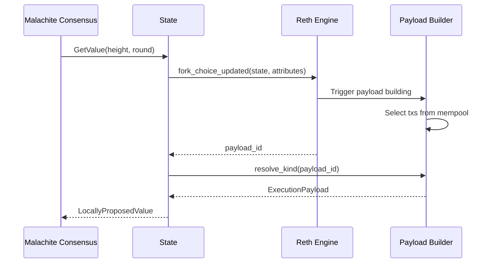
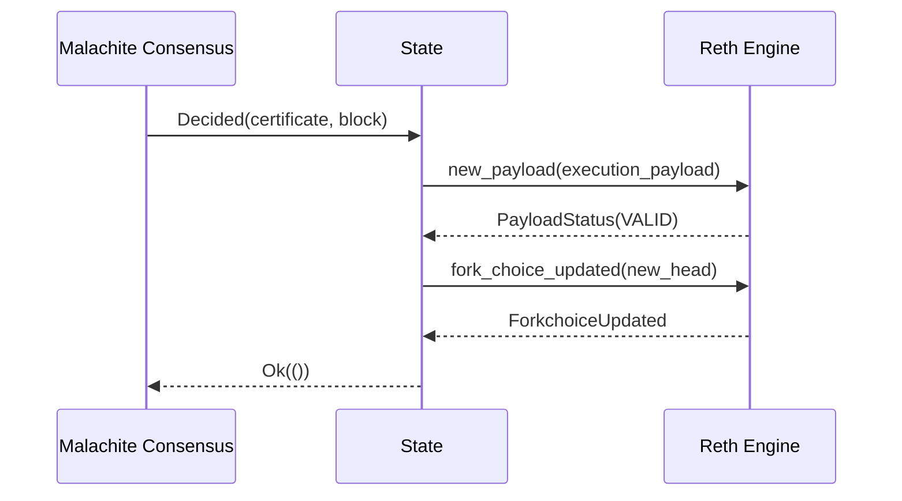
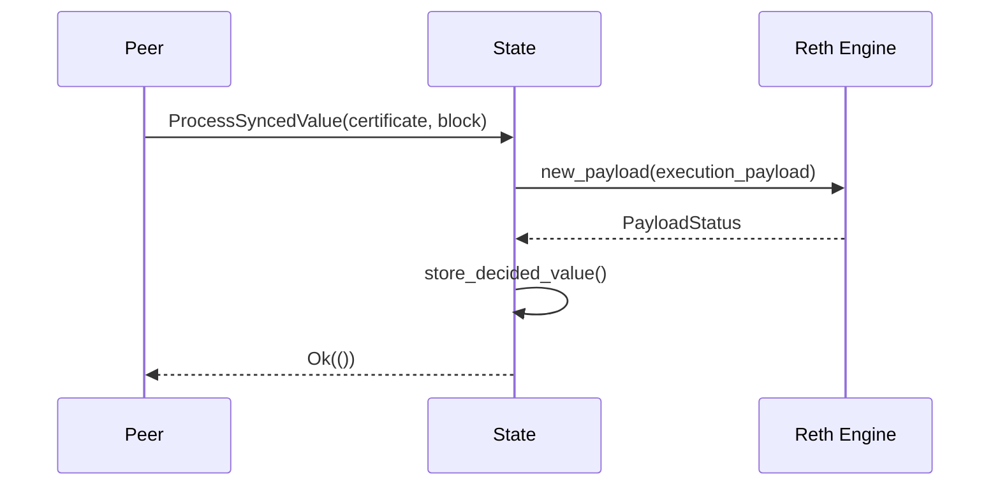

# Malachite-Reth Engine Interactions

This document describes the communication architecture between Malachite consensus and Reth execution engine in the reth-malachite implementation.

## Overview

The architecture follows a Tendermint-like pattern with ABCI-style separation:
- **Malachite** acts as the consensus engine (similar to Tendermint Core)
- **Reth** acts as the application/state machine (similar to the ABCI app)
- Communication happens through the **Engine API** (analogous to ABCI but using Ethereum's Engine API specification)

In this architecture:
- Consensus (Malachite) is responsible for block ordering and achieving agreement on the canonical chain
- The application (Reth) is responsible for transaction selection, ordering within blocks, execution, and maintaining state
- The Engine API provides the interface between consensus and execution layers

## Architecture

### Key Components

1. **BeaconConsensusEngineHandle** (`engine_handle`)
   - Primary communication channel to Reth's execution engine
   - Handles Engine API methods: `new_payload`, `fork_choice_updated`
   - Manages block validation and chain state updates

2. **PayloadBuilderHandle** (wrapped in `PayloadStore`)
   - Manages block building operations
   - Coordinates with mempool for transaction inclusion
   - Provides built payloads for consensus proposals

### State Structure

```rust
pub struct State {
    // Engine API communication
    pub engine_handle: BeaconConsensusEngineHandle<<EthereumNode as NodeTypes>::Payload>,

    // Payload building
    pub payload_store: Arc<PayloadStore<<EthereumNode as NodeTypes>::Payload>>,

    // Other components
    pub store: Arc<Store>,
    pub sync: Arc<Sync>,
    // ...
}
```

## Communication Flows

### 1. Block Production Flow

When Malachite needs to propose a new block:



**Implementation** (`State::propose_value`):
```rust
// 1. Prepare fork choice state
let forkchoice_state = ForkchoiceState {
    head_block_hash: parent_hash,
    safe_block_hash: parent_hash,
    finalized_block_hash: self.get_finalized_hash().await?,
};

// 2. Prepare payload attributes
let payload_attrs = PayloadAttributes {
    timestamp: current_timestamp(),
    prev_randao: B256::ZERO,
    suggested_fee_recipient: self.config.fee_recipient,
    withdrawals: Some(vec![]),
    parent_beacon_block_root: Some(B256::ZERO),
};

// 3. Send FCU to trigger building
let fcu_response = self.engine_handle.fork_choice_updated(
    forkchoice_state,
    Some(payload_attrs),
    EngineApiMessageVersion::V3,
).await?;

// 4. Get built payload (Reth has selected and ordered txs)
let payload = self.payload_store
    .resolve_kind(fcu_response.payload_id.unwrap(), PayloadKind::WaitForPending)
    .await?;
```

### 2. Block Finalization Flow

When consensus decides on a block:



**Implementation** (`State::commit`):
```rust
// 1. Validate the block
let payload = block_to_payload(sealed_block);
let payload_status = self.engine_handle.new_payload(payload).await?;

if payload_status.status != PayloadStatusEnum::Valid {
    return Err(eyre::eyre!("Invalid payload: {:?}", payload_status));
}

// 2. Update fork choice (instant finality)
let forkchoice_state = ForkchoiceState {
    head_block_hash: block_hash,
    safe_block_hash: block_hash,      // Same due to instant finality
    finalized_block_hash: block_hash,  // Same due to instant finality
};

self.engine_handle.fork_choice_updated(
    forkchoice_state,
    None,  // No new payload to build
    EngineApiMessageVersion::V3,
).await?;
```

### 3. Sync Block Validation Flow

During sync, blocks need validation before being stored:



**Implementation** (`State::validate_synced_block`):
```rust
pub async fn validate_synced_block(
    &self,
    certificate: CommitCertificate<MalachiteContext>,
    block: Block,
) -> Result<()> {
    // Validate execution
    let sealed_block = SealedBlock::seal_slow(block.clone());
    let payload = block_to_payload(sealed_block);
    let payload_status = self.engine_handle.new_payload(payload).await?;

    if payload_status.status != PayloadStatusEnum::Valid {
        return Err(eyre::eyre!("Invalid synced block: {:?}", payload_status));
    }

    // Store for later finalization
    let value = Value::new(block);
    self.store.store_decided_value(certificate, value).await?;

    Ok(())
}
```

## Message Types

### Engine API Messages

1. **ForkchoiceState**
   ```rust
   ForkchoiceState {
       head_block_hash: B256,      // Current chain head
       safe_block_hash: B256,      // Latest safe block
       finalized_block_hash: B256, // Latest finalized block
   }
   ```

2. **PayloadAttributes**
   ```rust
   PayloadAttributes {
       timestamp: u64,                    // Block timestamp
       prev_randao: B256,                // Randomness (unused)
       suggested_fee_recipient: Address,  // Coinbase address
       withdrawals: Option<Vec<Withdrawal>>,
       parent_beacon_block_root: Option<B256>,
   }
   ```

3. **PayloadStatus**
   ```rust
   PayloadStatus {
       status: PayloadStatusEnum,  // VALID, INVALID, SYNCING
       latest_valid_hash: Option<B256>,
       validation_error: Option<String>,
   }
   ```

### Consensus Messages (AppMsg)

Messages from Malachite to the State:

1. **GetValue** - Request block proposal (triggers Reth to build payload)
2. **Decided** - Finalize decided block
3. **ProcessSyncedValue** - Validate synced block
4. **GetDecidedValue** - Query decided blocks
5. **GetValidatorSet** - Query validator information

## State Queries

### Finalization Status

```rust
// Get finalized block hash
let finalized_hash = state.get_finalized_hash().await?;

// Get last finalized height
let height = state.last_finalized_height.load(Ordering::Relaxed);
```

### Block Queries

```rust
// Get decided block by height
let value = state.get_decided_value(height).await?;

// Get block by hash
let block = state.provider.block_by_hash(hash)?;
```

## Error Handling

The engine interaction includes robust error handling:

1. **Invalid Payloads**
   - Detected via `PayloadStatusEnum::Invalid`
   - Block is rejected and not finalized

2. **Engine Unavailable**
   - Connection errors propagated as `EngineApiError`
   - Consensus can retry or handle gracefully

3. **Payload Build Timeout**
   - Configurable timeout in `PayloadStore`
   - Falls back to empty block if needed

## Instant Finality

A key difference from standard Ethereum:
- Malachite provides **instant finality**
- When committing: `head = safe = finalized`
- No need for separate finalization process

## Configuration

Engine interaction is configured through:

```rust
Config {
    fee_recipient: Address,     // Block rewards recipient
    engine_endpoint: String,    // Engine API endpoint
    jwt_secret: String,        // Authentication secret
    // ...
}
```
