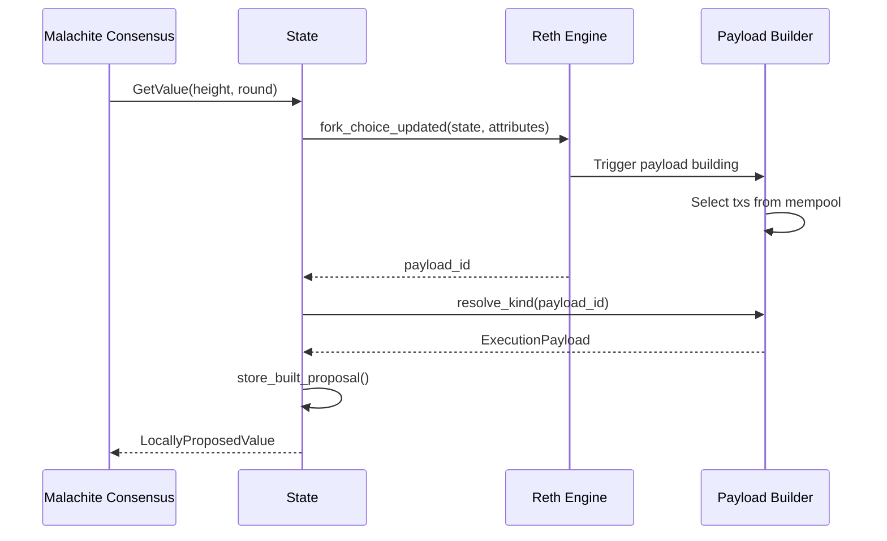
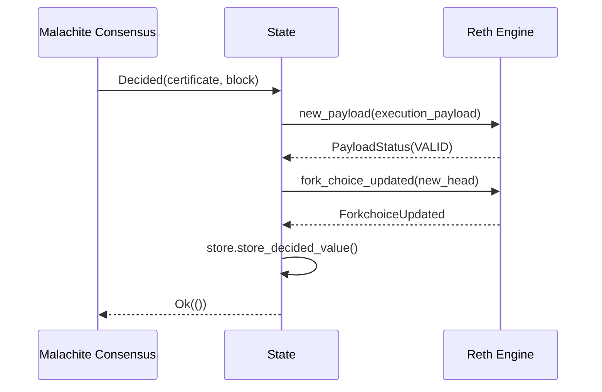
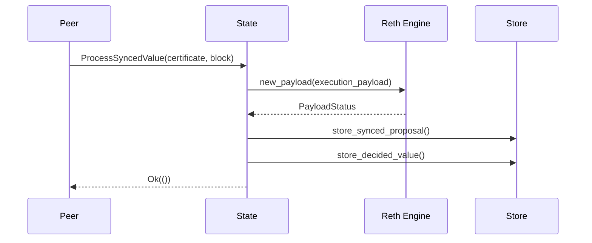
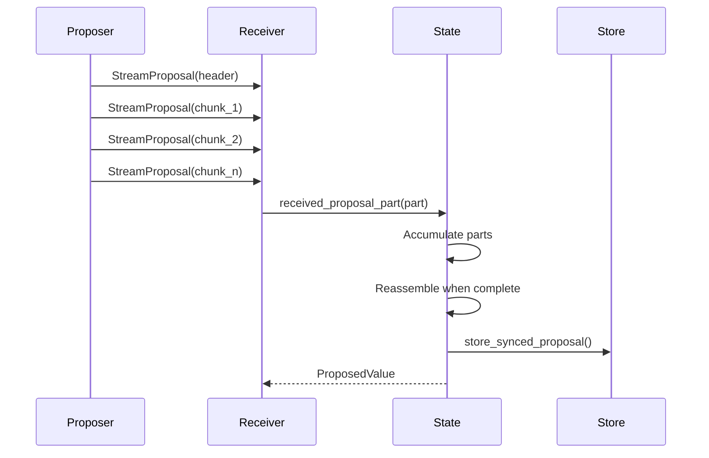

# Malachite-Reth Engine Interactions

This document describes the communication architecture between Malachite consensus and Reth execution engine in the reth-malachite implementation.

## Overview

The architecture follows a Tendermint-like pattern with ABCI-style separation:
- **Malachite** acts as the consensus engine (similar to Tendermint Core)
- **Reth** acts as the application/state machine (similar to the ABCI app)
- Communication happens through the **Engine API** (analogous to ABCI but using Ethereum's Engine API specification)

In this architecture:
- Consensus (Malachite) is responsible for block ordering and achieving agreement on the canonical chain
- The application (Reth) is responsible for transaction selection, ordering within blocks, execution, and maintaining state
- The Engine API provides the interface between consensus and execution layers

## Architecture

### Key Components

1. **BeaconConsensusEngineHandle** (`engine_handle`)
   - Primary communication channel to Reth's execution engine
   - Handles Engine API methods: `new_payload`, `fork_choice_updated`
   - Manages block validation and chain state updates

2. **PayloadBuilderHandle** (wrapped in `PayloadStore`)
   - Manages block building operations
   - Coordinates with mempool for transaction inclusion
   - Provides built payloads for consensus proposals

3. **Store** (abstraction layer)
   - Provides persistence for consensus data
   - Stores decided values, proposals, and validator sets
   - Abstracts away the underlying storage implementation

### State Structure

```rust
pub struct State {
    // Engine API communication
    pub engine_handle: BeaconConsensusEngineHandle<<EthereumNode as NodeTypes>::Payload>,

    // Payload building
    pub payload_store: Arc<PayloadStore<<EthereumNode as NodeTypes>::Payload>>,

    // Storage layer
    pub store: Arc<Store>,
    
    // Configuration
    pub config: Config,
    pub genesis: Genesis,
    
    // Thread-safe state
    pub last_finalized_height: Arc<AtomicU64>,
    pub signing_provider: Arc<Ed25519Provider>,
    pub rng: Arc<RwLock<ThreadSafeRng>>,
    
    // Proposal streaming
    pub received_parts: Arc<RwLock<ReceivedPartsMap>>,
    pub part_streams: Arc<RwLock<PartStreamsMap>>,
}
```

## Communication Flows

### 1. Block Production Flow

When Malachite needs to propose a new block:



**Implementation** (`State::propose_value`):
```rust
// 1. Prepare fork choice state
let forkchoice_state = ForkchoiceState {
    head_block_hash: parent_hash,
    safe_block_hash: parent_hash,
    finalized_block_hash: self.get_finalized_hash().await?,
};

// 2. Prepare payload attributes
let payload_attrs = PayloadAttributes {
    timestamp: current_timestamp(),
    prev_randao: B256::ZERO,
    suggested_fee_recipient: self.config.fee_recipient,
    withdrawals: Some(vec![]),
    parent_beacon_block_root: Some(B256::ZERO),
};

// 3. Send FCU to trigger building
let fcu_response = self.engine_handle.fork_choice_updated(
    forkchoice_state,
    Some(payload_attrs),
    EngineApiMessageVersion::V3,
).await?;

// 4. Get built payload (Reth has selected and ordered txs)
let payload = self.payload_store
    .resolve_kind(fcu_response.payload_id.unwrap(), PayloadKind::WaitForPending)
    .await?;

// 5. Store proposal for restreaming
self.store.store_built_proposal(height, round, value_id, value.clone()).await?;
```

### 2. Block Finalization Flow

When consensus decides on a block:



**Implementation** (`State::commit`):
```rust
// 1. Validate the block
let payload = block_to_payload(sealed_block);
let payload_status = self.engine_handle.new_payload(payload).await?;

if payload_status.status != PayloadStatusEnum::Valid {
    return Err(eyre::eyre!("Invalid payload: {:?}", payload_status));
}

// 2. Update fork choice (instant finality)
let forkchoice_state = ForkchoiceState {
    head_block_hash: block_hash,
    safe_block_hash: block_hash,      // Same due to instant finality
    finalized_block_hash: block_hash,  // Same due to instant finality
};

self.engine_handle.fork_choice_updated(
    forkchoice_state,
    None,  // No new payload to build
    EngineApiMessageVersion::V3,
).await?;

// 3. Store decided value
self.store.store_decided_value(certificate, value).await?;
```

### 3. Sync Block Validation Flow

During sync, blocks need validation before being stored:



**Implementation** (`State::validate_synced_block`):
```rust
pub async fn validate_synced_block(
    &self,
    certificate: CommitCertificate<MalachiteContext>,
    block: Block,
) -> Result<()> {
    // Validate execution
    let sealed_block = SealedBlock::seal_slow(block.clone());
    let payload = block_to_payload(sealed_block);
    let payload_status = self.engine_handle.new_payload(payload).await?;

    if payload_status.status != PayloadStatusEnum::Valid {
        return Err(eyre::eyre!("Invalid synced block: {:?}", payload_status));
    }

    // Store proposal for potential restreaming
    let value = Value::new(block);
    let value_id = value.id();
    self.store.store_synced_proposal(
        height, round, proposer, value_id, value.clone()
    ).await?;

    // Store for later finalization
    self.store.store_decided_value(certificate, value).await?;

    Ok(())
}
```

### 4. Proposal Streaming Flow

For large blocks, proposals are streamed in parts:



**Implementation**:
```rust
// Streaming a proposal
pub async fn stream_proposal(&self, height: Height, round: Round) -> Result<()> {
    let value = self.get_proposal_for_restreaming(height, round).await?;
    let value_bytes = encode_value(&value)?;
    
    // Stream header
    let header = StreamMessage::new_header(
        value.id(),
        value_bytes.len(),
        self.config.streaming_settings.chunk_size,
    );
    tx.send(header)?;
    
    // Stream chunks
    for (i, chunk) in value_bytes.chunks(chunk_size).enumerate() {
        let msg = StreamMessage::new_chunk(value.id(), i, chunk.to_vec());
        tx.send(msg)?;
    }
}

// Receiving proposal parts
pub async fn received_proposal_part(
    &self,
    height: Height,
    round: Round,
    part: ProposalPart,
) -> Option<ProposedValue<MalachiteContext>> {
    // Accumulate parts
    let mut received_parts = self.received_parts.write().await;
    let stream_state = received_parts.entry((height, round)).or_insert_with(...);
    
    match stream_state.add_part(part) {
        StreamState::Complete(value_bytes) => {
            let value = decode_value(&value_bytes)?;
            Some(ProposedValue::new(height, round, validity, value))
        }
        StreamState::InProgress(_) => None,
    }
}
```

## Message Types

### Engine API Messages

1. **ForkchoiceState**
   ```rust
   ForkchoiceState {
       head_block_hash: B256,      // Current chain head
       safe_block_hash: B256,      // Latest safe block
       finalized_block_hash: B256, // Latest finalized block
   }
   ```

2. **PayloadAttributes**
   ```rust
   PayloadAttributes {
       timestamp: u64,                    // Block timestamp
       prev_randao: B256,                // Randomness (unused)
       suggested_fee_recipient: Address,  // Coinbase address
       withdrawals: Option<Vec<Withdrawal>>,
       parent_beacon_block_root: Option<B256>,
   }
   ```

3. **PayloadStatus**
   ```rust
   PayloadStatus {
       status: PayloadStatusEnum,  // VALID, INVALID, SYNCING
       latest_valid_hash: Option<B256>,
       validation_error: Option<String>,
   }
   ```

### Consensus Messages (AppMsg)

Messages from Malachite to the State:

1. **GetValue** - Request block proposal (triggers Reth to build payload)
2. **Decided** - Finalize decided block
3. **ProcessSyncedValue** - Validate synced block
4. **GetDecidedValue** - Query decided blocks
5. **GetValidatorSet** - Query validator information
6. **GetMaxDecidedHeight** - Query highest decided block
7. **ReceivedProposalPart** - Handle streamed proposal chunks
8. **RestreamProposal** - Request proposal restreaming

## Store Abstraction Layer

The Store provides a clean abstraction for consensus data persistence:

### Store Interface

```rust
pub trait Store {
    // Decision storage
    async fn store_decided_value(
        &self,
        certificate: CommitCertificate<MalachiteContext>,
        value: Value,
    ) -> Result<()>;
    
    async fn get_decided_value(&self, height: Height) -> Result<Option<DecidedValue>>;
    
    // Proposal storage
    async fn store_built_proposal(
        &self,
        height: Height,
        round: Round,
        value_id: ValueId,
        value: Value,
    ) -> Result<()>;
    
    async fn store_synced_proposal(
        &self,
        height: Height,
        round: Round,
        proposer: PublicKey,
        value_id: ValueId,
        value: Value,
    ) -> Result<()>;
    
    async fn get_proposal_for_restreaming(
        &self,
        height: Height,
        round: Round,
    ) -> Result<Option<(PublicKey, Value)>>;
    
    // Validator set management
    async fn get_validator_set(&self, height: Height) -> Result<Option<ValidatorSet>>;
}
```

### Storage Organization

The Store manages:
- **Decided values**: Finalized blocks with their commit certificates
- **Built proposals**: Locally created block proposals for restreaming
- **Synced proposals**: Proposals received from other validators
- **Validator sets**: Validator configuration per height

## Thread Safety and Concurrency

The State uses several thread-safety patterns:

### Shared State Management

```rust
// Atomic values for lock-free reads
pub last_finalized_height: Arc<AtomicU64>,

// RwLock for complex state requiring consistency
pub received_parts: Arc<RwLock<ReceivedPartsMap>>,
pub part_streams: Arc<RwLock<PartStreamsMap>>,

// Thread-safe RNG wrapper
pub struct ThreadSafeRng(StdRng);
unsafe impl Send for ThreadSafeRng {}
unsafe impl Sync for ThreadSafeRng {}
```

### Concurrent Access Patterns

1. **Read-heavy operations** use RwLock for optimized concurrent reads
2. **Atomic operations** for simple numeric values like height
3. **Arc wrapping** for shared ownership across async tasks
4. **Explicit Send + Sync** bounds for cross-thread usage

## Value Encoding/Decoding

Blocks are serialized using bincode for efficient binary encoding:

```rust
pub fn encode_value(value: &Value) -> Result<Vec<u8>> {
    bincode::serialize(value)
        .map_err(|e| eyre::eyre!("Failed to encode value: {}", e))
}

pub fn decode_value(bytes: &[u8]) -> Result<Value> {
    bincode::deserialize(bytes)
        .map_err(|e| eyre::eyre!("Failed to decode value: {}", e))
}
```

This encoding is used for:
- Proposal streaming over the network
- Storage persistence
- Hash computation for value IDs

## Consensus Handler

The consensus handler bridges Malachite consensus events to the application:

```rust
pub async fn run_consensus_handler(
    mut app_rx: AppReceiver<MalachiteContext>,
    state: Arc<State>,
) -> Result<()> {
    while let Some((msg, reply_tx)) = app_rx.recv().await {
        let result = match msg {
            AppMsg::StartedRound(h, r) => {
                state.started_round(h, r).await.map(|_| AppResponse::StartedRound)
            }
            AppMsg::GetValue(h, r, timeout) => {
                state.propose_value(h, r, timeout).await.map(AppResponse::GetValue)
            }
            AppMsg::ReceivedProposalPart(h, r, part) => {
                state.received_proposal_part(h, r, part).await.map(AppResponse::ReceivedProposalPart)
            }
            AppMsg::Decided(cert, value_bytes) => {
                let value = decode_value(&value_bytes)?;
                state.commit(cert, value).await.map(|_| AppResponse::Decided)
            }
            AppMsg::ProcessSyncedValue(cert, value_bytes) => {
                let value = decode_value(&value_bytes)?;
                state.validate_synced_block(cert, value).await.map(|_| AppResponse::ProcessSyncedValue)
            }
            // ... other message handlers
        };
        
        reply_tx.send(result)?;
    }
}
```

## Node Configuration and Setup

### Custom Node Type

```rust
#[derive(Debug, Clone, Default)]
struct RethNode {
    common: RethNodeCommon,
}

impl NodeTypes for RethNode {
    type Engine = MalachiteConsensusEngine;
    // ... other associated types
}
```

### Consensus Engine Builder

```rust
pub struct MalachiteConsensusBuilder {
    state: Arc<State>,
}

impl ConsensusBuilder<Node> for MalachiteConsensusBuilder {
    async fn build(self, ctx: &BuilderContext<Node>) -> eyre::Result<Arc<dyn Consensus>> {
        Ok(Arc::new(MalachiteConsensusEngine {
            state: self.state,
        }))
    }
}
```

### Payload Service Configuration

The custom payload service integrates with Malachite's proposal system:

```rust
pub struct MalachitePayloadServiceBuilder {
    state: Arc<State>,
}

impl PayloadServiceBuilder<Node> for MalachitePayloadServiceBuilder {
    async fn spawn_payload_service(
        self,
        ctx: &BuilderContext<Node>,
    ) -> eyre::Result<PayloadBuilderHandle<EngineTypes>> {
        // Configure payload builder with custom settings
        let payload_builder = EthereumPayloadBuilder::new(config);
        
        // Spawn service
        let service = PayloadBuilderService::new(payload_builder);
        
        Ok(handle)
    }
}
```

## State Queries

### Finalization Status

```rust
// Get finalized block hash
let finalized_hash = state.get_finalized_hash().await?;

// Get last finalized height
let height = state.last_finalized_height.load(Ordering::Relaxed);
```

### Block Queries

```rust
// Get decided block by height
let value = state.get_decided_value(height).await?;

// Get block by hash
let block = state.provider.block_by_hash(hash)?;

// Get undecided proposals
let proposals = state.get_undecided_proposals(min_height, max_height).await?;
```

### Validator Queries

```rust
// Get validator set at height
let validator_set = state.get_validator_set(height).await?;

// Get own validator address
let address = state.signing_provider.address();
```

## Error Handling

The engine interaction includes robust error handling:

1. **Invalid Payloads**
   - Detected via `PayloadStatusEnum::Invalid`
   - Block is rejected and not finalized

2. **Engine Unavailable**
   - Connection errors propagated as `EngineApiError`
   - Consensus can retry or handle gracefully

3. **Payload Build Timeout**
   - Configurable timeout in `PayloadStore`
   - Falls back to empty block if needed

4. **Streaming Errors**
   - Timeout for incomplete streams
   - Automatic cleanup of stale streaming state

## Instant Finality

A key difference from standard Ethereum:
- Malachite provides **instant finality**
- When committing: `head = safe = finalized`
- No need for separate finalization process
- Simplifies fork choice updates

## Configuration

Engine interaction is configured through:

```rust
Config {
    fee_recipient: Address,           // Block rewards recipient
    engine_endpoint: String,          // Engine API endpoint
    jwt_secret: String,               // Authentication secret
    streaming_settings: StreamingSettings {
        chunk_size: usize,            // Size of streaming chunks
        timeout: Duration,            // Streaming timeout
    },
    // ...
}
```

## Genesis and Validator Management

The genesis configuration defines the initial validator set:

```rust
pub struct Genesis {
    pub validators: Vec<ValidatorConfig>,
    pub genesis_time: u64,
    pub chain_id: String,
}

pub struct ValidatorConfig {
    pub signing_key: String,         // Ed25519 private key
    pub address: Address,            // Ethereum address
    pub voting_power: u64,           // Validator weight
}
```

Validators are managed through:
- Ed25519 keys for consensus signing
- Ethereum addresses for block rewards
- Configurable voting power for weighted consensus